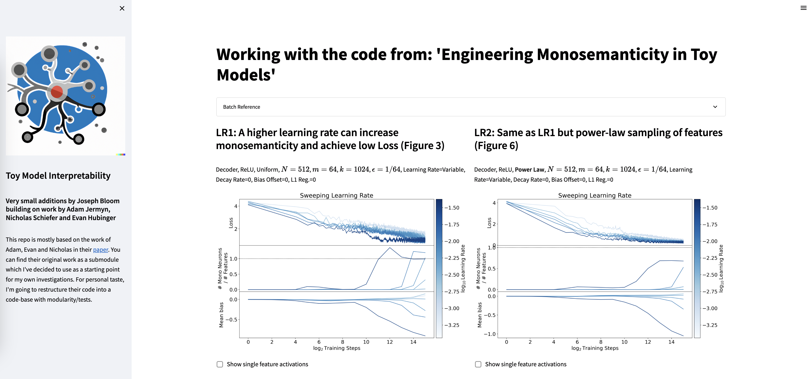

# Toy Model Interpretability

This repo is mostly based on the work of Adam, Evan and Nicholas in their [paper](https://arxiv.org/abs/2211.09169). This repo has their work as a submodule which I've decided to use as a starting point for my own investigations. For personal taste, I'm going to restructure their code into a package. 

# Set Up

Install the enviroment via conda:
```bash
conda env create --file environment.yml
```

Activate before running anything:
```
conda activate toy_model_interpretability
```

An example of how to run a sweep using refactored code: (note, see default values if you aren't passing in everything).
```bash
python3 -m main \
    --N 256 \
    --m 32 \
    --k 612 \
    --eps 0.015625 \
    --log2_batch_size 6 \
    --learning_rate 0.03 \
    --log2_training_steps 13 \
    --sample_kind equal \
    --task autoencoder \
    --decay 0 \
    --initial_bias 0 \
    --nonlinearity ReLU \
    --reg 0 \
    --sweep_var learning_rate \
    --sweep_values 0.001 0.003 \
    --file_name LR1_reduced \
    --device cpu 
```

You can then visualize the results using Adam's plot helper module. (I think this currently covers a
subset of the original paper's figures but I'll work on reproducing everything worthwhile eventually.)


## FAQ
### Why mechanistic interpretability? 

I don't know how neural networks work! In fact, we're still very confused about how they work as a species. So let's fix that. Specifically, [work visualizing features in neural networks](https://distill.pub/2020/circuits/zoom-in/) seems to suggest that networks can represent disparate concepts in the same feature which may be a signficant impediment to our ability to easily understand what is happening under the hood. This property is called "polysemanticity" or "superposition". While it is not the only problem we face by far, it seems like a reasonable enough place to start. 

I'm very interested in questions like:
- Can we robustly identify/measure polysemanticity? in toy networks? in LLM's?
- Can we remove polysemantcity? Can we engineer systems to be performant and have less polysemanticity?
- What new avenues in interpretability present themselves in highly monosemantic methods? 

I'm excited about a bunch of work that's come out recently on Superposition including:
* [Toy Models of Superpositon](https://transformer-circuits.pub/2022/toy_model/index.html)
* [Polysemanticity and Capacity in Neural Networks](https://www.lesswrong.com/posts/kWp4R9SYgKJFHAufB/polysemanticity-and-capacity-in-neural-networks)
* [Engineering Monosemanticity in Toy Modles](https://www.lesswrong.com/posts/LvznjZuygoeoTpSE6/engineering-monosemanticity-in-toy-models#comments)

A good summary of recent themes can be found [here](https://www.lesswrong.com/posts/Jgs7LQwmvErxR9BCC/current-themes-in-mechanistic-interpretability-research).

Related papers which I want to understand/replicate/think about more after my initial work here include:
- [The rest of the transformer circuits work](https://transformer-circuits.pub/)
- [Interpreting Neural Networks through the Polytope Lens](https://www.lesswrong.com/posts/eDicGjD9yte6FLSie/interpreting-neural-networks-through-the-polytope-lens)
- [A Mechanistic Interpretability Analysis of Grokking](https://www.lesswrong.com/posts/N6WM6hs7RQMKDhYjB/a-mechanistic-interpretability-analysis-of-grokking)

### What stage am I at?

Initial investigation:
* I'd like to explore the parameter space of Adam/co's original investigation. Choices like hyperparameters, learning rate scheduler, optimizer are things I'd like to check. 

Initial engineering:
* I'd like to write some tests. 
* I'd like to have cleaner interfaces/workflows for running/visualising results. 

### What are my long term goals? 

I'm currently doing [ARENA](https://www.arena.education/) after which I'll be looking for work as a research engineer. I'm interested in contributing to the AI Alignment problem and developing my skills in order to best support work in that research area.

To that end, I'd like this project to demonstrate how high quality code/ops practices accelerate research (as I think they might be undervalued currently). I do not think it is clear that this is a "high quality" alignment agenda, only that I find it accessible, and have various ideas I would like to test while building intuitions about neural networks.

### What am I currently doing? 

I'd like to reproduce the results/figures of the Engineering Monosemanticity post. To show these nicely, I've got a streamlit app:




I'm currently running a very simple script that takes advantage of the refactoring I've done to run all of the experiments easily.

The sweeps I'd like to do:

Table 1: Training parameters and model architectures.

| Batch | Task | Activation | Feature Dist. | $N$ | $m$ | $k$ | $\epsilon$ | Learning Rate | Decay Rate | Bias Offset | L1 Reg. |
| :---: | :---: | :---: | :---: | :---: | :---: | :---: | :---: | :---: | :---: | :---: | :---: |
| LR1 | Decoder | ReLU | Uniform | 512 | 64 | 1024 | $1 / 64$ | Variable | 0 | 0 | 0 |
| LR2 | Decoder | ReLU | Power-law | 512 | 64 | 1024 | $1 / 64$ | Variable | 0 | 0 | 0 |
| LR3 | Decoder | ReLU | Uniform | 512 | 64 | 1024 | $1 / 64$ | Variable | $0.03$ | $-1$ | 0 |
| B1 | Decoder | ReLU | Uniform | 512 | 64 | 1024 | $1 / 16$ | $0.003$ | $0.03$ | Variable | 0 |
| B2 | Decoder | ReLU | Uniform | 512 | 64 | 1024 | $1 / 32$ | $0.003$ | $0.003$ | Variable | 0 |
| B3 | Decoder | ReLU | Uniform | 512 | 64 | 1024 | $1 / 64$ | $0.003$ | $0.003$ | Variable | 0 |
| B4 | Decoder | ReLU | Uniform | 512 | 64 | 1024 | $1 / 128$ | $0.003$ | $0.003$ | Variable | 0 |
| B5 | Decoder | ReLU | Uniform | 512 | 64 | 1024 | $1 / 256$ | $0.003$ | $0.003$ | Variable | 0 |
| LR4 | Decoder | ReLU | Power-law | 512 | 64 | 1024 | $1 / 64$ | Variable | $0.03$ | $-1$ | 0 |
| B3 | Decoder | GeLU | Uniform | 512 | 64 | 1024 | $1 / 64$ | Variable | $0.03$ | Variable | 0 |
| E1 | Decoder | ReLU | Uniform | 512 | 64 | 1024 | Variable | $0.003$ | $0.03$ | $-1$ | 0 |
| E2 | Decoder | ReLU | Uniform | 512 | 64 | 1024 | Variable | $0.003$ | $0.01$ | $-1$ | 0 |
| E3 | Decoder | ReLU | Uniform | 512 | 64 | 1024 | Variable | $0.003$ | $0.003$ | $-1$ | 0 |
| E4 | Decoder | ReLU | Uniform | 512 | 64 | 1024 | Variable | $0.003$ | $0.001$ | $-1$ | 0 |
| K0 | Decoder | ReLU | Uniform | 512 | 64 | Variable | $1 / 64$ | $0.007$ | 0 | 0 | 0 |
| K1 | Decoder | ReLU | Uniform | 512 | 64 | Variable | $1 / 64$ | $0.007$ | $0.03$ |$-1$  | 0 |
| K2 | Decoder | ReLU | Power-law  | 512 | 64 | Variable | $1 / 64$ | $0.007$ | $0.03$ |$-1$  | 0 |
| RG1 | Decoder | ReLU | Uniform | 512 | 64 | 1024 | $1 / 64$ | $0.005$ | $0.03$ | $-1$  | Variable |
| RP1 | Re-Projector | ReLU | Uniform | 512 | 64 | 1024 | $1 / 64$ | Variable | $0.03$ | $-1$  | 0 |
| LR5 | Abs | ReLU | Uniform | 512 | 64 | 2048 | $1 / 64$ | Variable | $0.03$ | $-1$  | 0 |
| D1 | Abs | ReLU | Uniform | 512 | 64 | 2048 | $1 / 64$ | 0.007 | Variable | $-1$  | 0 |